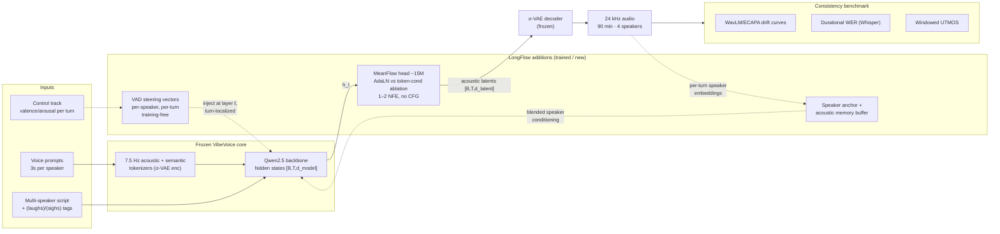

# LongFlow

**Fast, controllable, drift-free long-form multi-speaker TTS — built on a frozen VibeVoice.**

~~Target venue: Interspeech 2026 (fallback: ICASSP 2027 / ASRU) · arXiv preprint + demo page regardless of venue.~~
**[2026-08-10]** Interspeech 2026 has passed. Target venue: **ICASSP 2027 (submission deadline 2026-09-16)** for a reduced-scope paper if this week's gates say the data budget is small, else **Interspeech 2027 (~Mar 2027)** for full scope. arXiv preprint + demo page regardless. Scope decision gate: see `docs/review-2026-08-10.md` §5.

> **Status (2026-08-10):** Project reviewed after a month dormant. P1 gate PASSED; 10K scaling PASSED; E3 steps-scaling FAILED (overfit — data is the binding constraint); closed-loop fade CURED (sampler, not field). Stale claims below are struck through, not deleted. Full audit, field re-check, and the video-distillation recipe alignment: **`docs/review-2026-08-10.md`**. ~~Next action: run `experiments/p1_flow_head/gate_night1_colab.ipynb` + data-scaling curve (~5 GPU-h).~~
>
> **Status (2026-08-11) — Gate Night 1 ran (~$2).** Cells 2–3 **PASS**: the 75K paired noise→latent design is viable. Cells 5–6 **BLOCKING**: no sampler is both intelligible and dispersion-correct (heun8 0.238 WER vs euler4 0.079-but-under-dispersed → *the head is underfit; P2 MeanFlow is load-bearing for correctness, not just speed*), and batch-8 left-padded capture may be polluting conditioning. Cell 4 unusable at n=6 (reseed floor median 0.000, mean 0.076) so the **data-scaling curve was not run** — no valid noise band. Cell 7 produced new finding **N8**: VibeVoice inflates speaking rate **1.5×** (252 vs 168 wpm) on a 3229-word script, from the first 30 s — a teacher defect invisible to utterance-level eval, and the first thing C4's durational WER catches. **Venue: ICASSP 2027 is off on schedule grounds (not results); target Interspeech 2027.** Full record: **`experiments/p1_flow_head/NOTES.md`** (Gate Night 1 entry).

---

## Thesis (short form)

VibeVoice is the only open system that generates 90 minutes of 4-speaker dialogue, but it is slow (10-step DDPM head × 40,500 frames = 405K forward passes) and offers no emotion control and no consistency guarantees. Its Qwen2.5 hidden states are *pre-validated* conditioning — every cached `[B, T, d_model]` state already produced intelligible speech through the original diffusion head (d_model read from the checkpoint config — 1536 for VibeVoice-1.5B, 3584 for the 7B).

**We keep the entire VibeVoice stack frozen and change only what touches those hidden states:**

1. **Replace** the DDPM head with a 1–2 step flow-matching head (MeanFlow objective) ~~→ 15–20× faster generation~~. **[2026-08-10]** Own profiling (NOTES, Integration findings 2026-07-08): head is 35% of per-step cost → head swap alone is **1.47× end-to-end** (measured, 190→129ms/frame; Amdahl-capped). Honest claims: **8.4× head-level** (67→8ms euler4; 2.2× at dispersion-correct heun8). ~~**Quote the heun8 figures as the headline** — heun8 is the sampler that matches teacher dispersion (E1/E1b), and at heun8 the head is ~30ms/frame → **~1.24× e2e**.~~ **[RETRACTED 2026-08-11, Gate Night 1 cell 5]** heun8 is *not* shippable — WER 0.238 vs euler4's 0.079, worse in 5/6 utterances with semantic corruption. euler4 is intelligible but under-dispersed (causes the E1/E1b closed-loop fade). **No sampler is both; the shipped configuration is undecided and the fix is the head, not the integrator.** Always name the sampler beside the number. Upshot: **P2 MeanFlow is load-bearing for correctness, not just speed.** Also: first-packet latency, and a measured bottleneck map (CFG negative stream + 340M feedback encoder own the rest). RTF levers are CFG-stream removal, P4 encoder distillation, batching (5×, built).
2. ~~**Steer** the frozen backbone's activations per-speaker, time-localized, along continuous valence/arousal axes → training-free emotion control mid-conversation.~~ **[descoped 2026-07-07, P0 verdict PARTIAL — finding N7]** Steering localizes cleanly but VibeVoice's affect ceiling caps perception. Now a paper-appendix negative result; injection machinery retained in `src/steering/`.
3. **Anchor** speaker identity at inference with an acoustic memory buffer → measured, mitigated long-horizon drift.
4. **Measure** all of it with the first long-horizon consistency benchmark (drift curves, durational WER, windowed UTMOS at 30s → 90min).

No backbone training. No tokenizer training. Every contribution is a bolt-on to a working system, independently ablatable, and runnable on a single A100 (gate checks on an RTX 3090).

## Why this wins (positioning)

Every corner of the requirements exists somewhere in 2026 — long-form (VibeVoice), streaming dialogue (FireRedTTS-2), nonverbals (Dia2/SoulX-Podcast), one-step flow (ZipVoice-Distill/DSFlow/MeanFlow) — but **no system is simultaneously fast + 90-minute + 4-speaker + ~~emotion-controllable +~~ consistency-measured.** All one-step flow work to date is single-speaker short-form. All steering work (EmoSteer-TTS) is single-utterance. Nobody reports WER or speaker similarity at the 5–90 minute horizon.

## Novel contributions

| # | Contribution | Status of prior art |
|---|---|---|
| C1 | First flow-matching (MeanFlow, 1–2 NFE) replacement of VibeVoice's DDPM head; CFG eliminated via KD **[2026-08-10: phrase as first *offline head-distillation of a frozen third-party long-form system from its own cached inference states* + the N1/N2-vs-P1 conditioning-provenance contrast — NOT "first few-step flow head for TTS" (dots.tts 2606.07080 holds that)]** | ~~One-step FM exists only for short-form single-speaker~~ dots.tts (Jun 2026): MeanFlow head on own 2B AR backbone; lane "accelerate frozen third-party system" still unclaimed (verified 2026-08-10) |
| ~~C2~~ | ~~Per-speaker, time-localized activation steering along continuous VAD axes in a frozen dialogue backbone~~ **[descoped 2026-07-07 → negative-result appendix, N7]** | EmoSteer: single utterance, single speaker, discrete emotions |
| C3 | Inference-time speaker anchoring (anchor embedding + acoustic memory buffer blend) | Proposed heuristically; never implemented or evaluated |
| C4 | Long-horizon consistency benchmark: drift curves, durational WER, windowed UTMOS, nonverbal event P/R | Nobody evaluates beyond ~1 min |
| — | Negative-results appendix (TransplantTTS: MSE representation lock-in, cross-tokenizer ceiling) | Independently publishable findings |

## Architecture



**Inference path (unchanged upstream):** script + voice prompts → frozen Qwen2.5 backbone → hidden states → **MeanFlow head (new)** → acoustic latents → frozen σ-VAE decoder → audio. Steering and anchoring are inference-time interventions on the frozen backbone's conditioning — they require no training.

### Flow head (~15M params)
DiT-style MLP, no attention (each frame independently conditioned; the backbone already captured temporal context — validated by VibeVoice's own per-token head and by Flamed-TTS's attention-free result). Train Phase 1 with OT-CFM at 4 NFE as the safe baseline; Phase 2 with a MeanFlow objective targeting 1–2 NFE, ablating AdaLN vs token-based conditioning (DSFlow finding: AdaLN can be mismatched at few discrete steps).

### Steering (training-free)
Extract activation directions from contrast pairs generated by VibeVoice itself (same script, opposite emotional prompting) — no labeled corpus needed. Project onto continuous valence/arousal axes rather than discrete emotion buckets. Inject per-speaker, localized to that speaker's turns. Backbone layers, not the flow head: prosody and timing are decided upstream of the head.

### Speaker anchoring (inference-time)
`s̃_t = α·s_anchor + (1−α)·mean(buffer)` — immutable anchor embedding from the reference clip blended with a running average of the speaker's own generated turns. Tested as an ablation against the drift benchmark (α sweep; α=1 is the no-adaptation baseline).

## Data

| Purpose | Source | Size |
|---|---|---|
| Flow head training | Cached hidden states + σ-VAE latents from full VibeVoice inference on LibriTTS-R (feedback loop included — critical) | 75K samples |
| Turn-boundary coverage | Cached VibeVoice multi-speaker dialogue generations | 5–10K samples |
| Steering extraction | VibeVoice contrast-pair generations (same text, opposite affect) + Expresso for validation | ~20–50 pairs/axis |
| Nonverbal fine-tune (scoped, optional) | SoulX-style mined (laughs)/(sighs) annotations | small |

## Phases

1. **P0 — Steering gate check (cheapest, first).** Hook Qwen2.5 layers, extract VAD-axis directions from ~20 contrast pairs, inject, listen. 3090, no training, ~1 day. *Go/no-go for C2.*
2. **P1 — Flow head baseline.** Cache LibriTTS-R + dialogue states; OT-CFM 4-NFE head; gate: 1K samples/5K steps, decode + listen. Then full 75K run. Eval: WER, WavLM SIM, wall-clock vs DDPM baseline.
3. **P2 — MeanFlow 1–2 NFE.** MeanFlow objective (direct or distilled from P1); AdaLN vs token-conditioning ablation; CFG elimination via KD.
4. **P3 — Anchoring + benchmark.** Implement ASA; build eval harness (drift curves, durational WER, windowed UTMOS); run the full length ladder 30s→90min on all ablations.
5. **P4 — Encoder distillation (stretch).** 340M acoustic encoder → ~15M student (runs every AR step — real wall-clock, not polish).
6. **P5 — Paper + release.** Ablation table: DDPM → flow → +MeanFlow → +steering → +ASA. arXiv, demo page, open-source.

**Headline demo:** a 20-minute 4-speaker podcast generated in ~1 minute, with one speaker's arousal slider ramped live mid-episode.

## Rejected alternatives (related-work fodder)

- **Mamba-Flow-TTS (Gemini proposal, June 2026).** From-scratch 150M Mamba-2 backbone + Mimi latents + consistency FM head. Rejected: Stage 1 (AR-MSE backbone) → Stage 2 (flow head on those states) reproduces our documented TransplantTTS failure (MSE representation lock-in); no conversational training data yet claims dialogue; VAD controller has no supervision source; budget/eval tables are projections. Salvaged: ASA concept (→ C3), continuous VAD parameterization (→ C2), micro-testing discipline. Mamba backbone = legitimate future work.
- **Endurance v2 (F5-TTS long-form curriculum + latent carryover).** Sound plan, but explicitly single-speaker, no emotion — different paper. Keep as follow-on; its eval-harness design feeds C4.
- **TransplantTTS (archived).** Negative results retained as paper appendix.

## Repo

`github.com/Josh-E-S/LongFlow` — reuse the existing repo.

```
LongFlow/
├── README.md                  # this doc, trimmed
├── docs/
│   ├── architecture.mermaid   # diagram + design decisions
│   ├── negative-results.md    # TransplantTTS + rejected alternatives
│   └── benchmark.md           # C4 spec: metrics, length ladder, protocols
├── src/
│   ├── cache/                 # VibeVoice inference hooks → paired .pt dumps
│   ├── flow_head/             # OT-CFM + MeanFlow heads, samplers
│   ├── steering/              # extraction, VAD projection, injection hooks
│   ├── anchoring/             # ASA buffer + blend
│   └── eval/                  # drift curves, durational WER, windowed UTMOS
├── configs/                   # per-phase training/inference configs
├── experiments/               # gate-check notebooks, one dir per experiment
├── tests/                     # shape/gradient gates, 1-clip overfit gate
└── samples/                   # audio for the demo page (git-lfs)
```

~~Visibility: **private until P0 + P1 gate checks pass and the arXiv preprint is up, then public.**~~ **[2026-08-10]** Repo flipped public (P0+P1 gates passed; C2 — the scoop-able idea — is descoped, so pre-preprint exposure risk is materially lower than when this rule was written). Priority date comes from arXiv, not the repo. ~~The steering mechanism (C2) is the scoop-able idea, so don't publish the code before the preprint.~~ **[2026-08-10]** Superseded by the line above — C2 is descoped and the repo is already public. The scoop-able asset is now the *recipe instantiation* (stages 2–3 on speech, review §4), which lives in the paper, not the code. Tag a release at each phase gate so paper numbers are reproducible.
